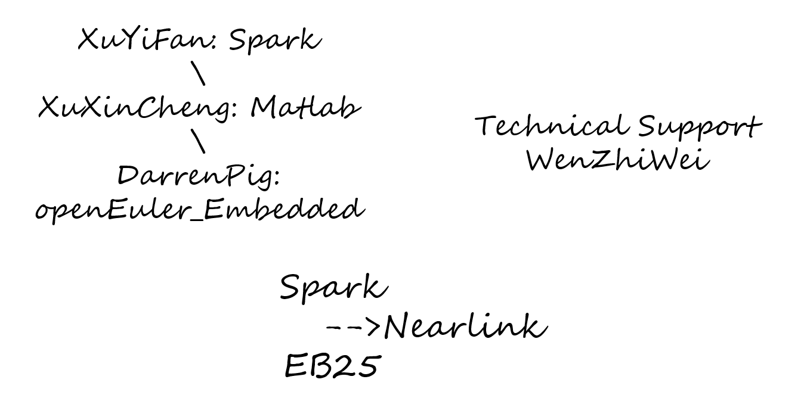
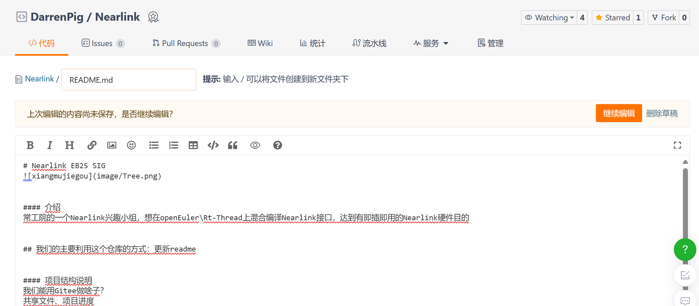

# Nearlink EB25 SIG
# https://lierda.feishu.cn/wiki/VBoPwV3oRiJRjWkb1ZkcgVMynmg
### 以下是大家可以轻松编辑交流的文档区：（提交方法在Readme结尾~~~）

 @和尚 【ROS开发板】https://www.yahboom.com/study/ROS-Driver-Board

#### 介绍

常工院的一个[Nearlink](https://www.hisilicon.com/cn/techtalk/nearlink)兴趣小组，想在openEuler\Rt-Thread上混合编译Nearlink接口，达到有即插即用的Nearlink硬件目的

## 我们的主要利用[这个仓库](https://gitee.com/darrenpig/openeuler-nearlink)的方式：更新readme

#### 项目结构说明
我们能用Gitee做啥子？
共享文件、项目进度

#### 资料共享

##### 1.使用手册：https://lierda.feishu.cn/wiki/VBoPwV3oRiJRjWkb1ZkcgVMynmg

##### 2.网址：https://lierda.feishu.cn/wiki/X360wInOjihWzukypNzc0Df5nHf?utm_source=pocket_saves

#### 项目进度
1.  3.25(明天)正式成立项目

#### 项目成员： @DarrenPig 、 @徐逸凡 、 @徐欣晨 ， @和尚 （大佬）

### 个人进度

####  @DarrenPig 
3.24 建立[仓库](https://gitee.com/darrenpig/openeuler-nearlink)，维护Readme
3.25 队友组织，相关文档的推送。
####  @徐逸凡 
3.25 拿板子

####  @徐欣晨 
3.24 预组会讨论

---
## 维护记录：
#### 3.24 @DarrenPig 建仓Readme，传文档
## 组会记录：
#### 2.24 图书馆二楼
---

### Way to use 修改Readme方法：

Image by <a href="https://www.freepik.com/free-psd/flat-design-plant-shop-template_40201855.htm#&position=26&from_view=author&uuid=eb059247-9847-433e-a0fe-1d7692fcd229">Freepik</a>
